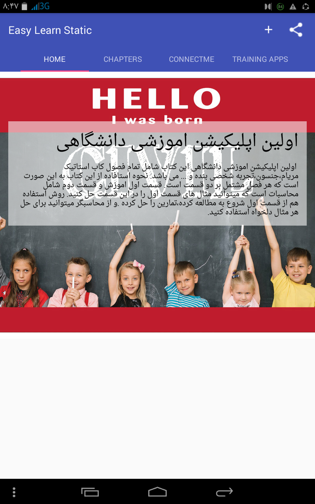
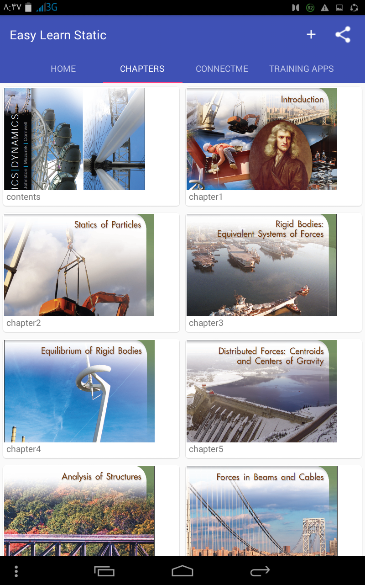
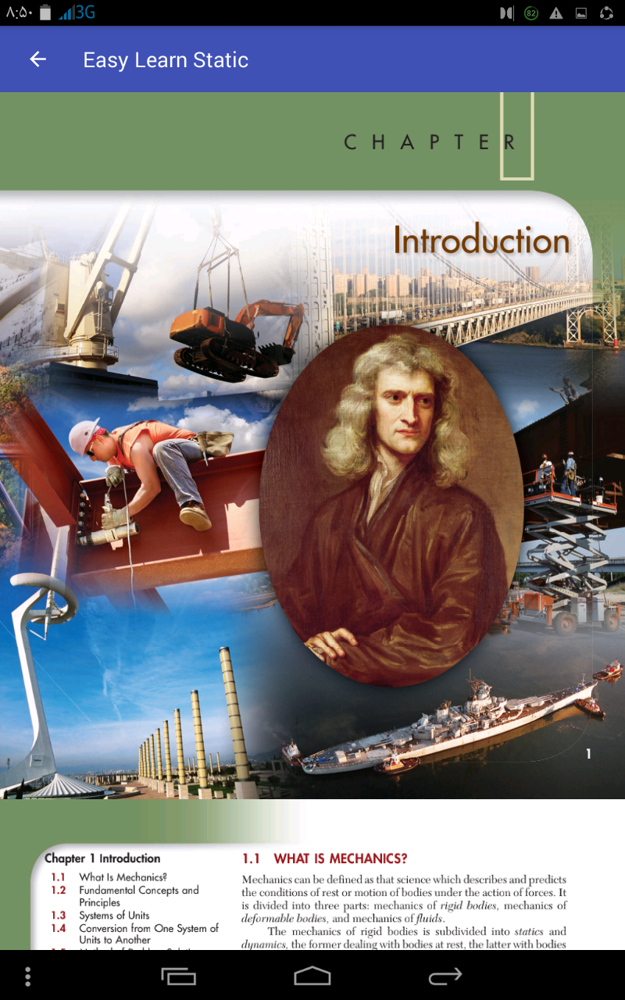
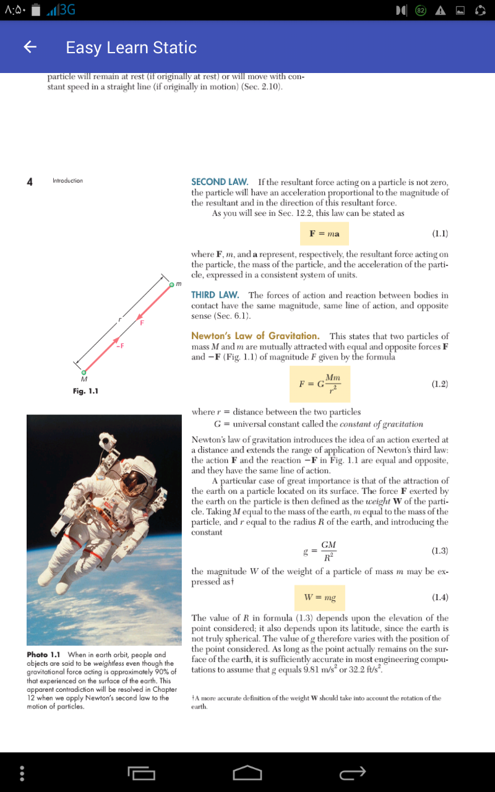
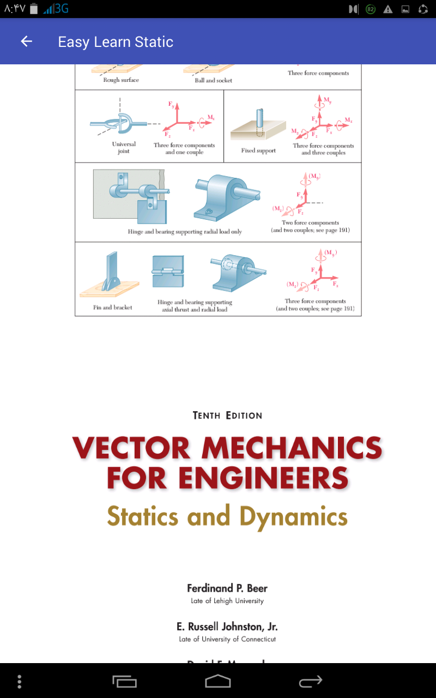
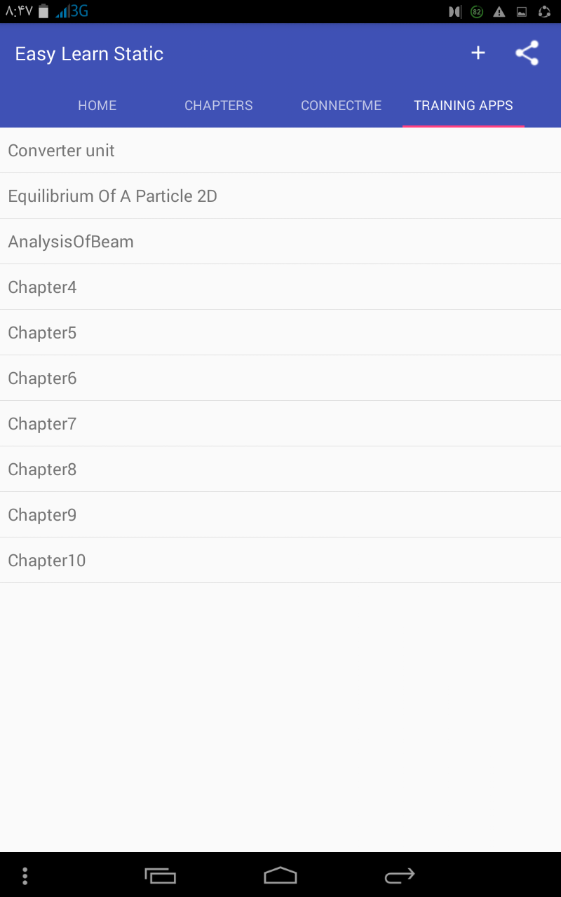
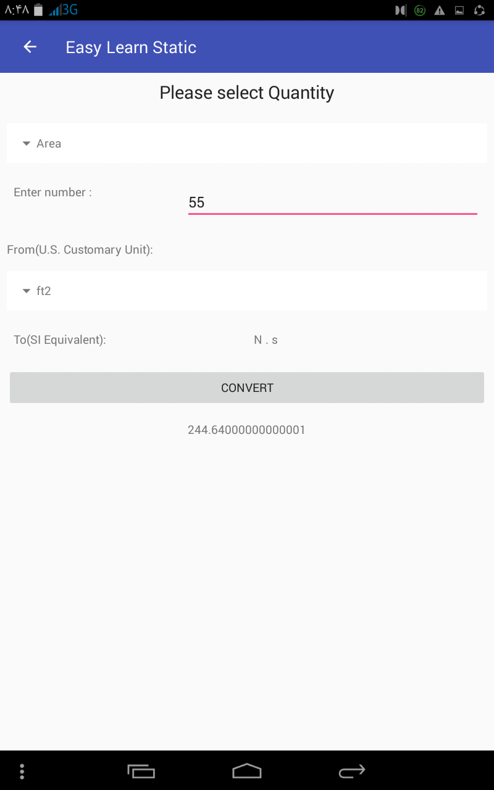
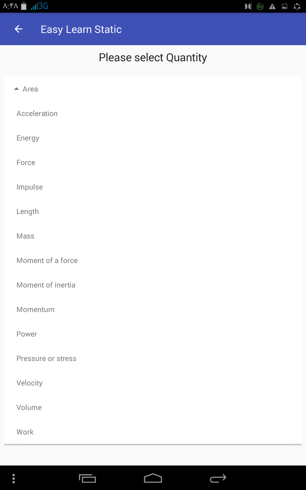
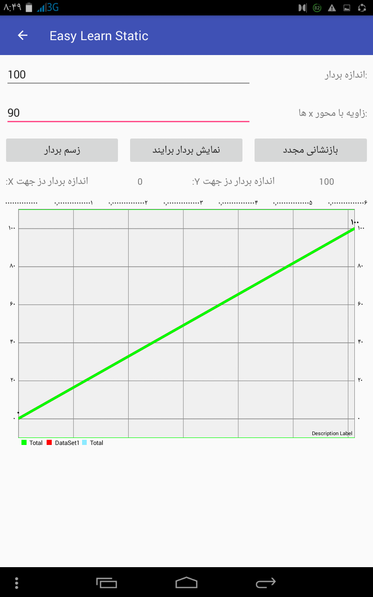
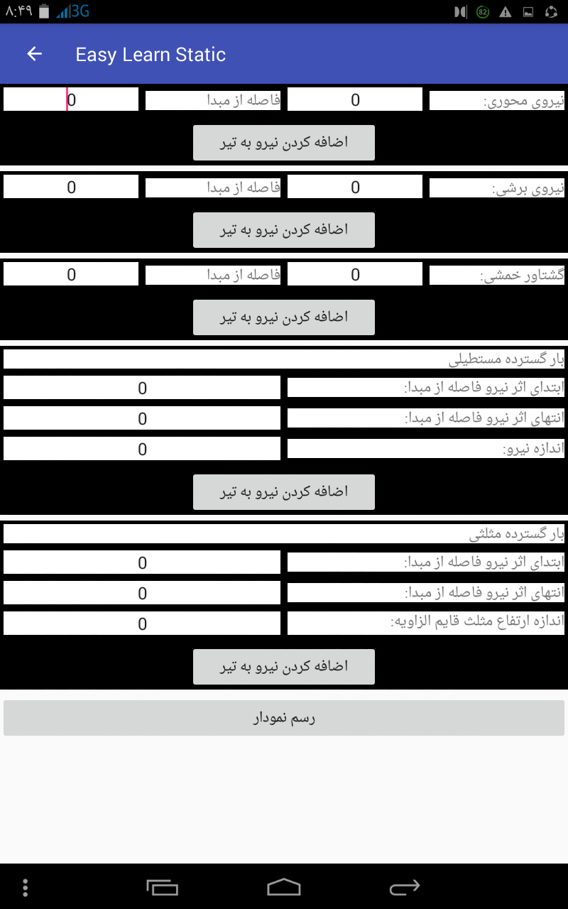

<h1>EasyLearningStatic</h1>

<strong>EasyLearningStatic</strong> is an Android application developed to offer users a simplified and streamlined way to access educational content offline. Ideal for students, educators, and self-learners, this app makes it easy to explore and reference static educational resources without the need for a constant internet connection.

<h2>Features</h2>
<ul>
    <li><strong>Offline Content Access</strong>: Provides static educational resources available offline for continuous learning.</li>
    <li><strong>User-Friendly Interface</strong>: A clean and easy-to-navigate UI, ensuring an intuitive learning experience.</li>
    <li><strong>Search Functionality</strong>: Quickly search for specific topics or content within the app.</li>
    <li><strong>Categorized Content</strong>: Organized educational materials by subject or category for easy reference.</li>
    <li><strong>Resource Management</strong>: Simple tools to manage downloaded materials for efficient storage.</li>
</ul>

<h2>Screenshots</h2>

Here’s a preview of EasyLearningStatic:

    
    
    
    
    
    
    
    
    
    

<h2>Technologies Used</h2>
<ul>
    <li><strong>Language</strong>: Java/Kotlin</li>
    <li><strong>Architecture</strong>: MVVM</li>
    <li><strong>Libraries</strong>: Retrofit, Room, Material Design Components</li>
    <li><strong>Offline Capabilities</strong>: Room for local data storage and access</li>
</ul>

<h2>Getting Started</h2>
<ol>
    <li>Clone the repository:</li>
    <pre><code>git clone https://github.com/EsmaeeilMoradi/EasyLearningStatic.git</code></pre>
    <li>Open the project in Android Studio.</li>
    <li>Build and run the application on an Android emulator or device.</li>
</ol>

<h2>Contributions</h2>

Contributions are welcome! Feel free to submit issues, suggest new features, or open pull requests.

<h2>License</h2>

This project is licensed under the MIT License. See the <a href="LICENSE">LICENSE</a> file for details.

